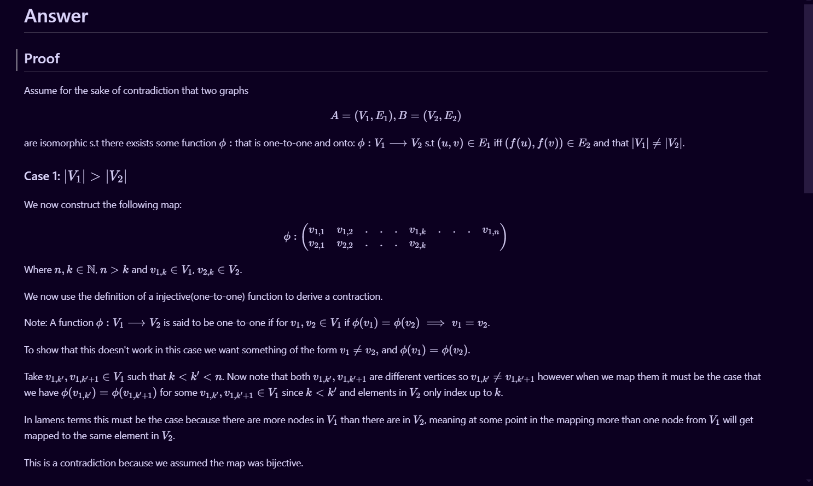
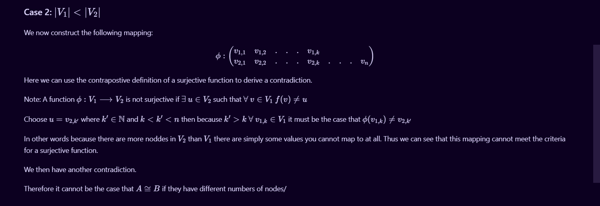

# Isomorphism

Prove that if two graphs $A$ and $B$ do not have the same number of nodes, they
cannot be isomorphic. I have started with the formal definition of isomorphism
below. Add your answer to this markdown file. [This
page](https://docs.github.com/en/get-started/writing-on-github/working-with-advanced-formatting/writing-mathematical-expressions)
might help with the notation for mathematical expressions.

$G_1=(V_1 , E_1)$ is isomorphic to $G_2 = (V_2, E_2)$ if there exists a
one-to-one and onto function (bijection) $f: V_1 \rightarrow V_2$ such that $(u,v)
\in E_1$ iff $(f(u),f(v)) \in E_2$.

“I certify that I have listed all sources used to complete this exercise, including the use
of any Large Language Models. All of the work is my own, except where stated
otherwise. I am aware that plagiarism carries severe penalties and that if plagiarism is
suspected, charges may be filed against me without prior notice.”-Andrew Thomas

Sources
#1-https://www.youtube.com/watch?v=EwV4Puk2coU-Used this to learn about graph isomorpism and used the map notation introduced in this video

## Answer is In PDF File !

